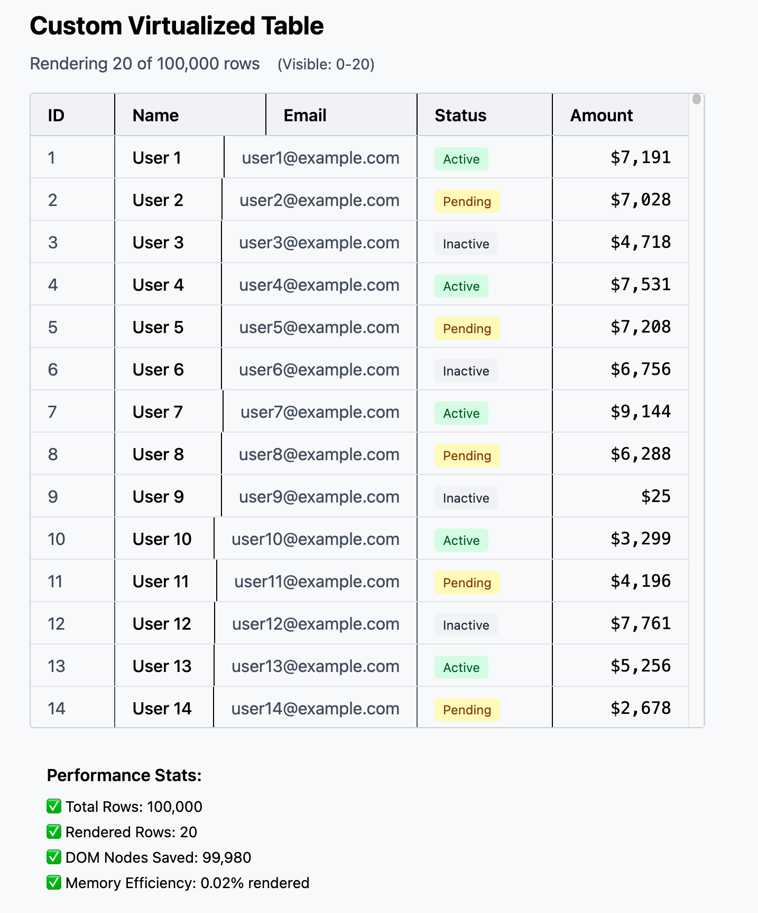
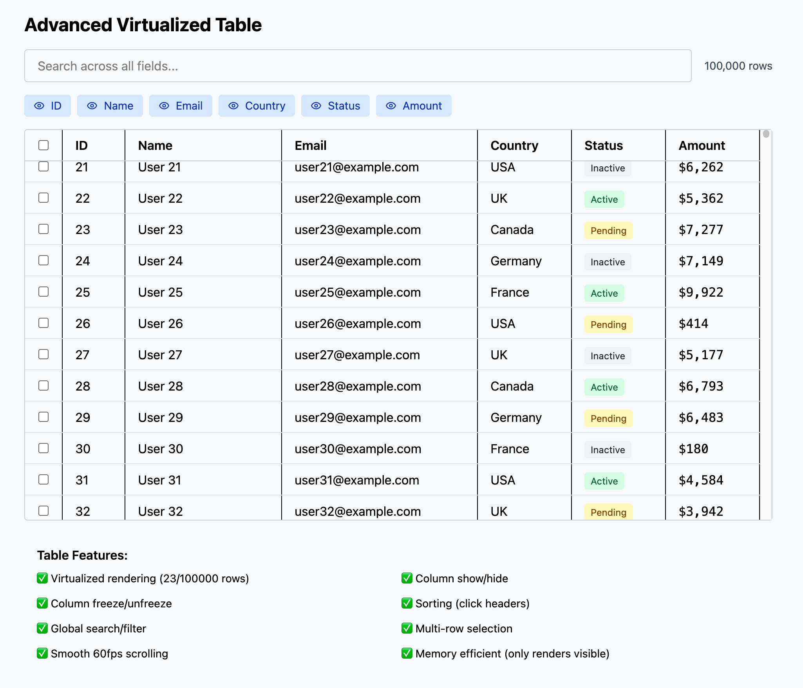

# TanStack Table Tutorial - Advanced Employee Directory

A comprehensive, production-ready example of **TanStack Table v8** (React Table) demonstrating advanced features for building complex, data-dense table UIs.





## 🎯 Overview

This tutorial builds a fully-featured **Employee Directory** with 1,000 rows of sample data, showcasing enterprise-grade table functionality including sorting, filtering, pagination, row selection, and column visibility controls.

## ✨ Features Implemented

### Core Table Features
- ✅ **Multi-column sorting** - Click headers to sort ascending/descending
- ✅ **Global search** - Search across all columns simultaneously
- ✅ **Column-specific filters** - Filter by name and department
- ✅ **Row selection** - Select individual rows or all rows with indeterminate checkbox state
- ✅ **Column visibility toggle** - Show/hide columns dynamically
- ✅ **Pagination** - Navigate through pages with customizable page sizes

### Advanced Features
- ✅ **Custom cell renderers** - Badges, formatted currency, clickable emails
- ✅ **Status indicators** - Visual status dots with color coding
- ✅ **Bulk actions toolbar** - Appears when rows are selected
- ✅ **Responsive design** - Built with Tailwind CSS
- ✅ **Performance optimized** - Using `useMemo` and efficient state management

## 🛠 Technologies Used

- **React 18** - UI framework
- **TanStack Table v8** - Headless table library
- **Tailwind CSS** - Utility-first styling
- **Lucide React** - Icon library
- **TypeScript** - Type safety (optional)

## 📦 Installation

```bash
# Install dependencies
npm install @tanstack/react-table lucide-react

# Or with yarn
yarn add @tanstack/react-table lucide-react

# Or with pnpm
pnpm add @tanstack/react-table lucide-react
```

## 🚀 Quick Start

```jsx
import AdvancedTable from './AdvancedTable';

function App() {
  return <AdvancedTable />;
}
```

## 📋 Key Concepts

### 1. Column Definition
```javascript
const columns = useMemo(() => [
  {
    accessorKey: 'name',
    header: 'Name',
    cell: ({ getValue }) => <div>{getValue()}</div>,
  },
  // ... more columns
], []);
```

### 2. Table Instance
```javascript
const table = useReactTable({
  data,
  columns,
  getCoreRowModel: getCoreRowModel(),
  getFilteredRowModel: getFilteredRowModel(),
  getPaginationRowModel: getPaginationRowModel(),
  getSortedRowModel: getSortedRowModel(),
});
```

### 3. State Management
```javascript
const [sorting, setSorting] = useState([]);
const [columnFilters, setColumnFilters] = useState([]);
const [rowSelection, setRowSelection] = useState({});
const [globalFilter, setGlobalFilter] = useState('');
```

### 4. Indeterminate Checkbox Pattern
```javascript
const checkbox = React.useRef(null);
React.useEffect(() => {
  if (checkbox.current) {
    checkbox.current.indeterminate = 
      table.getIsSomeRowsSelected() && !table.getIsAllRowsSelected();
  }
}, [table.getIsSomeRowsSelected(), table.getIsAllRowsSelected()]);
```

## 🎨 UI Components

### Global Search
```jsx
<input
  value={globalFilter ?? ''}
  onChange={(e) => setGlobalFilter(e.target.value)}
  placeholder="Search all columns..."
/>
```

### Column Visibility Toggle
```jsx
{table.getAllLeafColumns().map((column) => (
  <label>
    <input
      type="checkbox"
      checked={column.getIsVisible()}
      onChange={column.getToggleVisibilityHandler()}
    />
    {column.id}
  </label>
))}
```

### Pagination Controls
```jsx
<button onClick={() => table.previousPage()} 
        disabled={!table.getCanPreviousPage()}>
  Previous
</button>
<button onClick={() => table.nextPage()} 
        disabled={!table.getCanNextPage()}>
  Next
</button>
```

## 📊 Data Structure

```javascript
type Employee = {
  id: number;
  name: string;
  email: string;
  department: string;
  salary: number;
  startDate: string;
  status: 'Active' | 'Inactive' | 'On Leave';
};
```

## 🎯 Use Cases

This example is perfect for:
- **Admin dashboards** - User management, data tables
- **Enterprise applications** - Employee directories, inventory systems
- **Data-heavy UIs** - Analytics platforms, reporting tools
- **CRM/ERP systems** - Contact management, order tracking

## 🔧 Customization

### Adding New Columns
```javascript
{
  accessorKey: 'newField',
  header: 'New Field',
  cell: ({ getValue }) => <span>{getValue()}</span>,
}
```

### Custom Filters
```javascript
{
  accessorKey: 'department',
  filterFn: 'includesString', // or custom function
}
```

### Custom Cell Renderers
```javascript
cell: ({ getValue }) => {
  const value = getValue();
  return <CustomComponent value={value} />;
}
```

## 🚀 Performance Tips

1. **Use `useMemo`** for column definitions
2. **Enable pagination** for large datasets (10k+ rows)
3. **Implement virtualization** for 100k+ rows (use `@tanstack/react-virtual`)
4. **Debounce search inputs** for better UX
5. **Lazy load data** with server-side pagination

## 📚 Learn More

- [TanStack Table Docs](https://tanstack.com/table/v8/docs/introduction)
- [TanStack Table Examples](https://tanstack.com/table/v8/docs/examples/react/basic)
- [Column Definitions Guide](https://tanstack.com/table/v8/docs/guide/column-defs)
- [Sorting Guide](https://tanstack.com/table/v8/docs/guide/sorting)
- [Filtering Guide](https://tanstack.com/table/v8/docs/guide/filters)

## 🤝 Comparison with Other Libraries

| Feature | TanStack Table | ag-Grid | Handsontable |
|---------|---------------|---------|--------------|
| **Headless** | ✅ Yes | ❌ No | ❌ No |
| **Bundle Size** | ~15KB | ~500KB | ~300KB |
| **Flexibility** | ⭐⭐⭐⭐⭐ | ⭐⭐⭐ | ⭐⭐⭐ |
| **Free Tier** | ✅ Fully free | Limited | Limited |
| **Learning Curve** | Medium | Steep | Medium |
| **Framework Agnostic** | ✅ Yes | ✅ Yes | ✅ Yes |

## 🐛 Common Issues & Solutions

### Issue: Indeterminate checkbox warning
**Solution**: Use `ref` and `useEffect` to set the DOM property directly (not as React prop)

### Issue: Slow rendering with large datasets
**Solution**: Enable pagination or implement virtualization with `@tanstack/react-virtual`

### Issue: Filters not working
**Solution**: Ensure `getFilteredRowModel()` is included in table config

### Issue: Sorting not working
**Solution**: Ensure `getSortedRowModel()` is included in table config

## 📝 License

MIT - Feel free to use this in your projects!

## 👨‍💻 Author

**Amir Saeed**  
Senior Full-Stack Developer | 12+ Years Experience  
- Portfolio: [https://amirsaeed.co.uk](https://amirsaeed.co.uk)

---

## 🎓 Learning Outcomes

After completing this tutorial, you will understand:
- ✅ How to configure TanStack Table with multiple features
- ✅ State management patterns for complex tables
- ✅ Custom cell renderers and formatters
- ✅ Sorting, filtering, and pagination implementation
- ✅ Row selection with bulk actions
- ✅ Performance optimization techniques
- ✅ Production-ready table patterns

**Perfect for job interviews and real-world applications!** 🚀